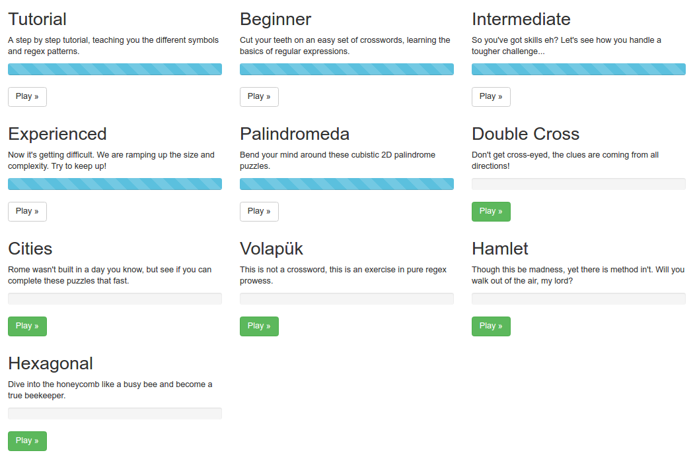

# Day 7 Homework

## 1. FSA to RegEx

### a.
`01(11)*0`

### b.
`0*10*`

### c.
`1*`

## 2. Parenthesis Matching

### a.
`(\(\))*`

### b.
`(\((\(\))*\))*`

### c.
`(\((\((\(\))*\))*\))*`

## 3. Challenge Problems

### a.
`\b((0*1){2})*0*10*\b`

### b.
`\b((1*0){2})*1*\b`

### c.
`...`

### d.
`...`

## 4. RegEx Practice

