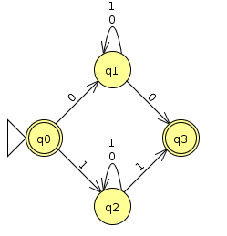

# FOCS Homework for Day 9

You may edit your answers into this file, or add a separate file in the same directory.

If you add a separate file, please include the following at the top:

```
Student Name: Joey Maalouf
Check one:
[X] I completed this assignment without assistance or external resources.
[ ] I completed this assignment with assistance from ___
   and/or using these external resources: ___
```

## 1. For each of the following languages, decide whether it is regular

For each of the following languages, decide whether it is regular.  If it is regular, give a regular expression or finite automaton that recognizes the language.  If it is not regular, demonstrate that using the pumping lemma.

---

a) Strings containing only the symbol a whose length is a power of 2 (*i.e.* length 2^n)

[The strings `a`, `aa`, `aaaa`, and `aaaaaaaa` are in this language; the string `aaaaa` is not.]

Not regular. Proof:

Assume this language _L_ is regular. By the pumping lemma, there is some _p_ such that every _w_ in _L_ of length ≥ _p_ can be split into the substrings _w_ = _xyz_, where |_y_| ≥ 1, |_xy_| ≤ _p_, and for all _i_ ≥ 0, _xy<sup>i</sup>z_ ∈ _L_.

Let _w_ ∈ _L_ be `a`<sup>2<sup>_n_</sup></sup>. We know _y_, the repeating segment, consists of 1 or more `a`s. If we pump our _w_ such that _xyz_ becomes _xyyz_, we know that _xyyz_ must also be in _L_. The only way for this to be true is if |_y_| is equal to the difference in two consecutive powers of 2 (minus the lengths of _x_ and _z_). If this is the case, we can pump again and say that _xyyyz_ must also be in _L_. Since we know that no two consecutive sets of powers of 2 have the same difference (i.e. 2<sup>_i_</sup>-2<sup>_i_-1</sup> ≠ 2<sup>_i_+1</sup>-2<sup>_i_</sup>), this can't possibly also be true, and thus we have shown that there is no possible repeating ("pumping") segment for this language, meaning that our assumption was false and _L_ is not regular.

---

b) All strings with an equal number of occurrences of the substrings `01` and `10`.

[`010` is in this language; `000110` is in the language; `0101010` is in the language; but `010101` is not.]

Regular. `ε | 0Σ*0 | 1Σ*1`.

As long as the string begins and ends with the same character, then it has the same number of `01`s and `10`s, because each time the string switches from one character to the other, it increments one of the two counters, and if it changes again, it increments the other, keeping them equal. It's somewhat reminiscent of the left and right parentheses matching.



[(JFLAP file here)](1b.jff)

---

c) All strings (over {0,1}) consisting of a substring _w_ followed by the reverse of the substring.

[The strings `00100100` and `11110101011010101111` are in this language; the strings `00100` and `010101 `are not.]

Not regular. Proof:

Assume this language _L_ is regular. By the pumping lemma, there is some _p_ such that every _w_ in _L_ of length ≥ _p_ can be split into the substrings _w_ = _xyz_, where |_y_| ≥ 1, |_xy_| ≤ _p_, and for all _i_ ≥ 0, _xy<sup>i</sup>z_ ∈ _L_.

Let _v_ ∈ _L_ be some _w_ _w_<sup>R</sup>. We know _y_, the repeating segment, is made up entirely of parts of _w_, _w_<sup>R</sup>, or both. If we pump our _v_ such that _xyz_ becomes _xyyz_, we know that _xyyz_ must also be in _L_. The only way for this to be true is if the first half of _y_ is the end of _w_ and the second half of _y_ is the beginning of _w_, with both halves having equal length. In such a case, we can simply shift/lengthen/shorten our selection by any nonzero amount. Now, any pumping will offset one of the two sides (_w_ and _w_<sup>R</sup>) more than the other, preventing our new string from being in _L_. This contradicts the pumping lemma; thus, we have shown that our assumption is false and _L_ is not regular.

## 2. Play the pumping game

Play the **pumping game** (referenced on the [Day 8 page](https://sites.google.com/site/focs16fall/in-class-exercises/day-8) and also found at [http://weitz.de/pump/](http://weitz.de/pump/)).  Solve at least two puzzles from that page (that do NOT appear in question 1, above) and provide the word you chose, the substring the computer chose, and your successfully pumped string.

Notation notes:

- The notation |w| sub a means the number of `a`'s in the word _w_.
- _a_^_n_ means _n_ occurrences of `a` (e.g. _a_^8 is `aaaaaaaa`)

If you have other questions about notation (or anything else), please post them to [Piazza](https://piazza.com) so that we can clarify for everyone.

## 3. Create a PDA

For one of the non-regular languages in problem 1 or 2 above, create a PDA (preferably in JFLAP) and include it with your completed homework.

## 4. Reading

Optionally read Sipser pp. 101–125.

Optionally read Stuart pp. 128–134.

## 5. Install gprolog

Please download and install [gprolog](http://www.gprolog.org) before coming to class:

**Ubuntu**:

	$ sudo apt-get install gprolog

**Mac**, with [Homebrew](http://brew.sh) installed:

	$ brew install gnu-prolog

**Mac** without Homebrew, and **Windows**:

- Follow the instructions at [http://www.gprolog.org/#download](http://www.gprolog.org/#download).
